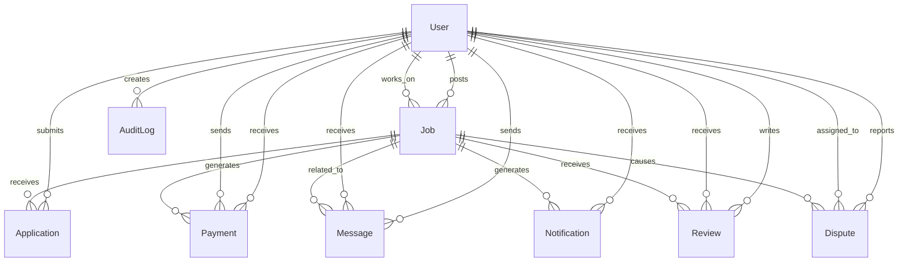

# Database Schema Documentation

This document provides comprehensive documentation of the TaskLink SA database schema, including all models, relationships, constraints, and business logic.

## 📊 Schema Overview

The TaskLink SA database is built with PostgreSQL and uses Prisma as the ORM. The schema follows a relational design optimized for the task marketplace domain.

### Core Entities



## 👤 User Model

The User model represents all platform users (clients, workers, admins).

### Schema Definition
```prisma
model User {
  id                String   @id @default(cuid())
  email            String   @unique
  phone            String?
  password         String
  firstName        String
  lastName         String
  profileImage     String?
  bio              String?
  location         String?   // City/Province in South Africa
  coordinates      Json?    // { lat: Float, lng: Float }
  skills           String[] // Array of skills user can offer
  rating           Float    @default(0)
  reviewCount      Int      @default(0)
  isVerified       Boolean  @default(false)
  verificationType String?  // "email", "phone", "id"
  idNumber         String?  // South African ID number for verification
  role             UserRole @default(CLIENT)
  isWorker         Boolean  @default(false)
  isClient         Boolean  @default(true)
  isSuspended      Boolean  @default(false)
  suspensionReason String?
  suspendedAt      DateTime?
  suspendedBy      String?
  lastLoginAt      DateTime?
  loginAttempts    Int      @default(0)
  lockedAt         DateTime?
  completedJobs    Int      @default(0)
  totalEarned      Float    @default(0) // In ZAR
  createdAt        DateTime @default(now())
  updatedAt        DateTime @updatedAt

  // Relations
  postedJobs       Job[]           @relation("JobPoster")
  takenJobs        Job[]           @relation("JobWorker")
  sentMessages     Message[]       @relation("MessageSender")
  receivedMessages Message[]       @relation("MessageReceiver")
  reviewsGiven     Review[]        @relation("ReviewAuthor")
  reviewsReceived  Review[]        @relation("ReviewSubject")
  notifications    Notification[]
  payments         Payment[]
  auditLogs        AuditLog[]
  reportedDisputes Dispute[]       @relation("DisputeReporter")
  disputesAgainst  Dispute[]       @relation("DisputeReportedUser")
  assignedDisputes Dispute[]       @relation("DisputeAssignedAdmin")

  @@map("users")
}
```

### Field Descriptions

#### Identity & Authentication
- **id**: CUID primary key for global uniqueness
- **email**: Unique email address (required)
- **phone**: South African phone number (optional)
- **password**: Bcrypt-hashed password (required)

#### Profile Information
- **firstName/lastName**: User's full name (required)
- **profileImage**: URL to profile photo (optional)
- **bio**: User biography, max 500 characters (optional)
- **location**: City/Province in South Africa (optional)
- **coordinates**: GPS coordinates as JSON {lat, lng} (optional)

#### Skills & Rating
- **skills**: Array of user skills (empty for clients)
- **rating**: Average rating from 0-5 (calculated field)
- **reviewCount**: Number of reviews received (calculated field)

#### Verification & Status
- **isVerified**: ID verification status
- **verificationType**: Type of verification ("email", "phone", "id")
- **idNumber**: South African ID number (encrypted)
- **role**: User role (CLIENT, WORKER, ADMIN)
- **isWorker**: Can apply for jobs
- **isClient**: Can post jobs
- **isSuspended**: Account suspension status
- **suspensionReason**: Reason for suspension
- **suspendedAt/suspendedBy**: Suspension metadata

#### Security
- **lastLoginAt**: Last successful login timestamp
- **loginAttempts**: Failed login attempt counter
- **lockedAt**: Account lock timestamp

#### Business Metrics
- **completedJobs**: Number of completed jobs
- **totalEarned**: Total earnings in ZAR

## 💼 Job Model

The Job model represents task postings on the platform.

### Schema Definition
```prisma
model Job {
  id              String      @id @default(cuid())
  title           String
  description     String
  category        String      // "cleaning", "gardening", "tutoring", etc.
  subcategory     String?
  location        String      // Where the job needs to be done
  coordinates     Json?       // { lat: Float, lng: Float }
  budget          Float       // In ZAR
  budgetType      String      @default("fixed") // "fixed", "hourly"
  estimatedHours  Int?        // For hourly jobs
  status          JobStatus   @default(DRAFT)
  priority        JobPriority @default(MEDIUM)
  posterId        String
  workerId        String?     // Assigned worker
  completedAt     DateTime?
  expiresAt       DateTime?
  createdAt       DateTime    @default(now())
  updatedAt       DateTime    @updatedAt

  // Job requirements and preferences
  requirements    String[]    // Required skills/certifications
  preferredSkills String[]    // Preferred but not required skills
  equipmentNeeded String[]    // Tools/equipment needed
  ageRequirement  String?     // "18+", "21+", etc.
  genderPref      String?     // "male", "female", "any"

  // Media
  images          String[]    // URLs of job images

  // Relations
  poster          User           @relation("JobPoster", references: [id])
  worker          User?          @relation("JobWorker", references: [id])
  applications    Application[]
  payments        Payment[]
  reviews         Review[]
  messages        Message[]
  notifications   Notification[]
  disputes        Dispute[]

  @@map("jobs")
}
```

### Field Descriptions

#### Basic Information
- **id**: CUID primary key
- **title**: Job title (5-100 characters)
- **description**: Detailed job description (20-2000 characters)
- **category**: Job category (e.g., "cleaning", "gardening")
- **subcategory**: Job subcategory (optional)

#### Location & Budget
- **location**: Job location description
- **coordinates**: GPS coordinates (optional)
- **budget**: Job budget in ZAR
- **budgetType**: "fixed" or "hourly"
- **estimatedHours**: Hours for hourly jobs

#### Status & Priority
- **status**: Job status (DRAFT, OPEN, ASSIGNED, IN_PROGRESS, COMPLETED, CANCELLED, DISPUTED)
- **priority**: Job priority (LOW, MEDIUM, HIGH, URGENT)
- **posterId**: User who posted the job
- **workerId**: Assigned worker (optional)
- **completedAt**: Completion timestamp
- **expiresAt**: Job expiration date

#### Requirements
- **requirements**: Required skills/certifications
- **preferredSkills**: Preferred skills
- **equipmentNeeded**: Required tools/equipment
- **ageRequirement**: Minimum age requirement
- **genderPref**: Gender preference

#### Media
- **images**: Array of image URLs

## 📝 Application Model

The Application model represents worker applications for jobs.

### Schema Definition
```prisma
model Application {
  id          String   @id @default(cuid())
  jobId       String
  applicantId String
  message     String?  // Cover message from applicant
  proposedRate Float?  // Proposed rate in ZAR (can differ from budget)
  status      ApplicationStatus @default(PENDING)
  appliedAt   DateTime @default(now())
  respondedAt DateTime?

  // Relations
  job         Job      @relation(references: [id], onDelete: Cascade)
  applicant   User     @relation(references: [id])

  @@unique([jobId, applicantId])
  @@map("applications")
}
```

### Field Descriptions
- **id**: CUID primary key
- **jobId**: Reference to job
- **applicantId**: Reference to applicant user
- **message**: Cover letter/message (optional)
- **proposedRate**: Applicant's proposed rate (optional)
- **status**: Application status (PENDING, ACCEPTED, REJECTED, WITHDRAWN)
- **appliedAt**: Application timestamp
- **respondedAt**: Response timestamp

## 💰 Payment Model

The Payment model handles all financial transactions.

### Schema Definition
```prisma
model Payment {
  id              String        @id @default(cuid())
  amount          Float         // In ZAR
  currency        String        @default("ZAR")
  status          PaymentStatus @default(PENDING)
  paymentMethod   String?       // "card", "eft", "paypal", etc.
  paymentIntentId String?       // Stripe payment intent ID
  payfastId       String?       // PayFast payment ID
  description     String?
  jobId           String?
  clientId        String
  workerId        String
  fee             Float         @default(0) // Platform fee
  netAmount       Float         // Amount after fees
  paidAt          DateTime?
  createdAt       DateTime      @default(now())
  updatedAt       DateTime      @updatedAt

  // Relations
  job             Job?          @relation(references: [id])
  client          User          @relation("PaymentClient", references: [id])
  worker          User          @relation("PaymentWorker", references: [id])

  @@map("payments")
}
```

### Field Descriptions
- **id**: CUID primary key
- **amount**: Payment amount in ZAR
- **currency**: Currency code (default "ZAR")
- **status**: Payment status (PENDING, PROCESSING, COMPLETED, FAILED, REFUNDED, CANCELLED)
- **paymentMethod**: Payment method used
- **paymentIntentId**: External payment provider ID
- **payfastId**: PayFast transaction ID
- **description**: Payment description
- **jobId**: Associated job (optional)
- **clientId**: Paying client
- **workerId**: Receiving worker
- **fee**: Platform fee amount
- **netAmount**: Amount after fees
- **paidAt**: Payment completion timestamp

## ⭐ Review Model

The Review model handles user feedback and ratings.

### Schema Definition
```prisma
model Review {
  id        String   @id @default(cuid())
  rating    Int      // 1-5 stars
  comment   String?
  jobId     String
  reviewerId String  // Who wrote the review
  revieweeId String  // Who received the review
  isPublic  Boolean  @default(true)
  createdAt DateTime @default(now())
  updatedAt DateTime @updatedAt

  // Relations
  job       Job      @relation(references: [id])
  reviewer  User     @relation("ReviewAuthor", references: [id])
  reviewee  User     @relation("ReviewSubject", references: [id])

  @@map("reviews")
}
```

### Field Descriptions
- **id**: CUID primary key
- **rating**: Star rating (1-5)
- **comment**: Review text (optional)
- **jobId**: Associated job
- **reviewerId**: User who wrote the review
- **revieweeId**: User who received the review
- **isPublic**: Whether review is visible publicly
- **createdAt/updatedAt**: Timestamps

## 💬 Message Model

The Message model handles real-time communication.

### Schema Definition
```prisma
model Message {
  id          String      @id @default(cuid())
  content     String
  senderId    String
  receiverId  String
  jobId       String?     // Related job (optional for general messages)
  messageType MessageType @default(TEXT)
  isRead      Boolean     @default(false)
  readAt      DateTime?
  createdAt   DateTime    @default(now())

  // Relations
  sender      User        @relation("MessageSender", references: [id])
  receiver    User        @relation("MessageReceiver", references: [id])
  job         Job?        @relation(references: [id])

  @@map("messages")
}
```

### Field Descriptions
- **id**: CUID primary key
- **content**: Message content
- **senderId**: Message sender
- **receiverId**: Message receiver
- **jobId**: Related job (optional)
- **messageType**: Message type (TEXT, IMAGE, FILE, SYSTEM)
- **isRead**: Read status
- **readAt**: Read timestamp

## 🔔 Notification Model

The Notification model handles user notifications.

### Schema Definition
```prisma
model Notification {
  id          String           @id @default(cuid())
  userId      String
  title       String
  message     String
  type        NotificationType
  isRead      Boolean          @default(false)
  readAt      DateTime?
  actionUrl   String?          // URL to navigate to when clicked
  jobId       String?          // Related job
  createdAt   DateTime         @default(now())

  // Relations
  user        User             @relation(references: [id])
  job         Job?             @relation(references: [id])

  @@map("notifications")
}
```

### Field Descriptions
- **id**: CUID primary key
- **userId**: Notification recipient
- **title**: Notification title
- **message**: Notification content
- **type**: Notification type
- **isRead**: Read status
- **readAt**: Read timestamp
- **actionUrl**: Action URL (optional)
- **jobId**: Related job (optional)

## 📋 Audit Log Model

The AuditLog model tracks system activities for compliance.

### Schema Definition
```prisma
model AuditLog {
  id          String   @id @default(cuid())
  userId      String?  // Nullable for system actions
  action      String   // "CREATE", "UPDATE", "DELETE", "LOGIN", etc.
  entityType  String   // "User", "Job", "Payment", etc.
  entityId    String   // ID of the affected entity
  oldValues   Json?    // Previous state (for updates)
  newValues   Json?    // New state (for updates)
  ipAddress   String?
  userAgent   String?
  createdAt   DateTime @default(now())

  // Relations
  user        User?    @relation(references: [id])

  @@map("audit_logs")
}
```

### Field Descriptions
- **id**: CUID primary key
- **userId**: User who performed action (optional)
- **action**: Action performed
- **entityType**: Type of entity affected
- **entityId**: ID of affected entity
- **oldValues**: Previous state (JSON)
- **newValues**: New state (JSON)
- **ipAddress**: Client IP address
- **userAgent**: Client user agent

## ⚖️ Dispute Model

The Dispute model handles conflict resolution.

### Schema Definition
```prisma
model Dispute {
  id              String       @id @default(cuid())
  title           String
  description     String
  status          DisputeStatus @default(OPEN)
  priority        JobPriority  @default(MEDIUM)
  category        String       // "payment", "job_quality", "communication", etc.

  // Parties involved
  reporterId      String       // User who reported the dispute
  reportedUserId  String?      // User being reported (optional for general disputes)
  jobId           String?      // Related job (optional)

  // Resolution
  assignedAdminId String?      // Admin handling the dispute
  resolution      String?      // Admin's resolution decision
  resolvedAt      DateTime?    // When dispute was resolved
  closedAt        DateTime?    // When dispute was closed

  // Evidence and communication
  evidence        Json?        // Array of evidence files/URLs
  adminNotes      String?      // Internal admin notes

  createdAt       DateTime     @default(now())
  updatedAt       DateTime     @updatedAt

  // Relations
  reporter        User         @relation("DisputeReporter", references: [id])
  reportedUser    User?        @relation("DisputeReportedUser", references: [id])
  job             Job?         @relation(references: [id])
  assignedAdmin   User?        @relation("DisputeAssignedAdmin", references: [id])

  @@map("disputes")
}
```

### Field Descriptions
- **id**: CUID primary key
- **title**: Dispute title
- **description**: Dispute description
- **status**: Dispute status (OPEN, UNDER_REVIEW, RESOLVED, ESCALATED, CLOSED)
- **priority**: Dispute priority
- **category**: Dispute category
- **reporterId**: User who reported dispute
- **reportedUserId**: User being reported
- **jobId**: Related job (optional)
- **assignedAdminId**: Assigned admin
- **resolution**: Resolution decision
- **resolvedAt**: Resolution timestamp
- **closedAt**: Closure timestamp
- **evidence**: Evidence files/URLs (JSON)
- **adminNotes**: Internal notes

## 🔧 Enums

### UserRole
```prisma
enum UserRole {
  CLIENT
  WORKER
  ADMIN
}
```

### JobStatus
```prisma
enum JobStatus {
  DRAFT
  OPEN
  ASSIGNED
  IN_PROGRESS
  COMPLETED
  CANCELLED
  DISPUTED
}
```

### JobPriority
```prisma
enum JobPriority {
  LOW
  MEDIUM
  HIGH
  URGENT
}
```

### ApplicationStatus
```prisma
enum ApplicationStatus {
  PENDING
  ACCEPTED
  REJECTED
  WITHDRAWN
}
```

### PaymentStatus
```prisma
enum PaymentStatus {
  PENDING
  PROCESSING
  COMPLETED
  FAILED
  REFUNDED
  CANCELLED
}
```

### MessageType
```prisma
enum MessageType {
  TEXT
  IMAGE
  FILE
  SYSTEM
}
```

### NotificationType
```prisma
enum NotificationType {
  JOB_POSTED
  APPLICATION_RECEIVED
  APPLICATION_ACCEPTED
  APPLICATION_REJECTED
  JOB_ASSIGNED
  JOB_COMPLETED
  PAYMENT_RECEIVED
  REVIEW_RECEIVED
  MESSAGE_RECEIVED
  SYSTEM_ANNOUNCEMENT
}
```

### DisputeStatus
```prisma
enum DisputeStatus {
  OPEN
  UNDER_REVIEW
  RESOLVED
  ESCALATED
  CLOSED
}
```

## 📊 Database Indexes

### Primary Indexes
- All primary keys are automatically indexed
- Foreign key constraints include indexes

### Performance Indexes
```sql
-- Job search optimization
CREATE INDEX idx_jobs_location ON jobs USING GIST (location);
CREATE INDEX idx_jobs_budget ON jobs (budget);
CREATE INDEX idx_jobs_category ON jobs (category);
CREATE INDEX idx_jobs_status_created ON jobs (status, created_at DESC);

-- User search optimization
CREATE INDEX idx_users_location ON users USING GIST (coordinates);
CREATE INDEX idx_users_rating ON users (rating DESC);
CREATE INDEX idx_users_skills ON users USING GIN (skills);

-- Application optimization
CREATE INDEX idx_applications_job_status ON applications (job_id, status);
CREATE INDEX idx_applications_applicant_created ON applications (applicant_id, created_at DESC);

-- Payment optimization
CREATE INDEX idx_payments_status_created ON payments (status, created_at DESC);
CREATE INDEX idx_payments_client_worker ON payments (client_id, worker_id);

-- Message optimization
CREATE INDEX idx_messages_job_created ON messages (job_id, created_at DESC);
CREATE INDEX idx_messages_sender_receiver ON messages (sender_id, receiver_id, created_at DESC);
```

## 🔄 Data Migrations

### Migration Strategy
- **Versioned Migrations**: Each change has a numbered migration
- **Rollback Support**: All migrations are reversible
- **Data Preservation**: Existing data is preserved during migrations
- **Testing**: Migrations tested in staging before production

### Common Migration Patterns
```typescript
// Adding a new column
addColumn: 'ALTER TABLE users ADD COLUMN is_verified BOOLEAN DEFAULT false;'

// Adding an index
addIndex: 'CREATE INDEX idx_jobs_location ON jobs (location);'

// Data migration
migrateData: `
  UPDATE users
  SET is_verified = true
  WHERE verification_type IS NOT NULL;
`
```

## 🔒 Data Security

### Encryption
- **Passwords**: Bcrypt hashing with salt
- **PII**: Sensitive data encrypted at rest
- **In Transit**: TLS 1.3 encryption
- **API Keys**: Secure key management

### Access Control
- **Row Level Security**: Users can only access their own data
- **Field Level Encryption**: Sensitive fields encrypted
- **Audit Logging**: All data access logged
- **Data Masking**: PII masked in logs

### Backup & Recovery
- **Automated Backups**: Daily database snapshots
- **Point-in-time Recovery**: Up to 5-minute granularity
- **Cross-region Replication**: Geographic redundancy
- **Backup Encryption**: All backups encrypted

## 📈 Performance Optimization

### Query Optimization
- **Select Only Needed Fields**: Avoid `SELECT *`
- **Use Indexes**: Strategic index placement
- **Pagination**: Limit result sets
- **Connection Pooling**: Efficient connection management

### Caching Strategy
- **Application Cache**: Redis for session and temporary data
- **Database Cache**: PostgreSQL shared buffers
- **Query Cache**: Frequently accessed data cached
- **CDN**: Static assets cached globally

### Monitoring
- **Query Performance**: Slow query logging
- **Connection Pool**: Monitor connection usage
- **Index Usage**: Track index effectiveness
- **Storage Growth**: Monitor database size

---

This database schema provides a solid foundation for the TaskLink SA platform, designed for performance, security, and scalability while meeting South African regulatory requirements.